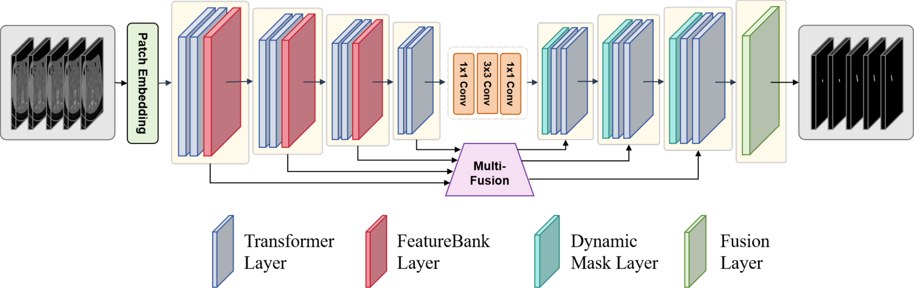

# ProDyS: Self-Supervised Feature Learning with Prototype-Guided Context Fusion and Progressive Optimization

> **Code coming soon.** This repository currently releases the manuscript, paper figures, reported results, and a preliminary environment baseline. The training and inference implementation will be added in a future update.

ProDyS is a self-supervised medical image segmentation framework designed to improve three aspects of segmentation quality: small-lesion recognition, boundary reconstruction, and feature generalization across data distributions.

## Paper status

The repository is organized around the English manuscript and its publication figures:

- [Full manuscript](docs/ProDyS_paper.md)
- [Method and qualitative figures](assets/figures/)
- Source code: **coming soon**
- Model checkpoints: not released
- Medical datasets: not included

## Abstract

Medical image segmentation places high demands on both accuracy and robustness. Existing methods can miss small lesions, produce blurred tissue boundaries, and adapt poorly to cross-domain distribution shifts. ProDyS addresses these challenges by combining progressive dynamic optimization with prototype-guided self-supervision. The framework introduces Parallel Multi-Branch Enhancement (PMBE) for multi-scale detail representation, Soft-Hard mask-guided Dynamic Up-sampling (SHD-UP) for boundary-aware feature recovery, and Prototype-Clustering-driven Self-supervised feature Alignment (PCSA) for feature-space alignment across data distributions.



## Contributions

1. **PMBE** uses heterogeneous parallel branches and gradient-aware multi-scale processing to strengthen representations of small targets, subtle structures, and low-contrast regions.
2. **SHD-UP** uses multi-level mask guidance and progressive feature fusion to improve boundary continuity and structural consistency during up-sampling.
3. **PCSA** maintains a dynamic feature bank with prototype clustering and momentum updates to improve representation alignment and cross-domain generalization.

### Module overview

| Module | Role | Figure |
|---|---|---|
| PMBE | Multi-scale gradient-parallel feature enhancement | [PMBE](assets/figures/pmbe.png) |
| SHD-UP | Soft-hard mask-guided dynamic up-sampling | [SHD-UP](assets/figures/shd_up.png) |
| PCSA | Prototype-clustering-driven self-supervised feature alignment | [Feature bank](assets/figures/pcsa_feature_bank.png) |

## Reported results

The following values are reported in the manuscript. They are not presented as independently reproduced results because the source code has not yet been released.

| Dataset | DSC (%) | mIoU (%) |
|---|---:|---:|
| BUSI | **81.63** | Not reported in the manuscript table |
| ISIC2018 | **90.62** | **83.92** |
| CVC_ClinicDB | **90.82** | **83.92** |
| SMAE | **80.92** | **69.32** |

The manuscript also reports ablations on SMAE and ISIC2018. The complete comparison tables and qualitative results are available in the [full manuscript](docs/ProDyS_paper.md).

### Qualitative comparisons

| Dataset | Figure |
|---|---|
| BUSI | [Qualitative comparison](assets/figures/busi_comparison.png) |
| ISIC2018 | [Qualitative comparison](assets/figures/isic2018_comparison.png) |
| CVC_ClinicDB | [Qualitative comparison](assets/figures/cvc_comparison.png) |
| SMAE | [Qualitative comparison](assets/figures/smae_comparison.png) |
| SMAE / ISIC2018 | [Ablation figure](assets/figures/ablation.png) |

## Datasets

The manuscript evaluates ProDyS on the public BUSI, ISIC2018, and CVC_ClinicDB datasets, together with a self-constructed SMAE dataset containing superior mesenteric artery embolism examination images. This repository does not redistribute any dataset or patient-level data. Please obtain public datasets from their original sources and follow their terms of use.

## Preliminary environment

The following files document a provisional baseline inferred from the manuscript's implementation details:

- [Conda environment](environment.yml)
- [Python requirements](requirements.txt)

The manuscript reports Python 3.10-style usage, 224x224 input images, batch size 8, 200 training epochs, SGD with an initial learning rate of `1e-4`, momentum `0.9`, weight decay `1e-4`, and a minimum learning rate of `1e-5`. Training was reported on an NVIDIA GeForce RTX 4090D with 24 GB memory. These settings will be validated against the released implementation.

Create the provisional environment with:

```bash
conda env create -f environment.yml
conda activate prodys
```

The PyTorch package should be selected for the local CUDA driver using the [official PyTorch installation selector](https://pytorch.org/get-started/locally/) when the code is released. Until then, the environment files are documentation scaffolding rather than a runnable training package.

## Repository status

| Component | Status |
|---|---|
| Manuscript | Available |
| Figures | Available as PNG assets |
| Source code | **Coming soon** |
| Training scripts | Not released |
| Checkpoints | Not released |
| Public dataset download scripts | Not released |
| SMAE dataset | Not included |

## Acknowledgements

The manuscript builds on the broader medical image segmentation literature and compares against established U-Net, Transformer, Mamba, and hybrid segmentation models. Dataset ownership and the licenses of all third-party components remain governed by their original sources.

## Citation

Please use the following draft entry until the author list and publication venue are finalized:

```bibtex
@article{prodys,
  title   = {ProDyS: Self-Supervised Feature Learning with Prototype-Guided Context Fusion and Progressive Optimization},
  author  = {The ProDyS authors},
  note    = {Manuscript version; publication metadata to be finalized}
}
```

## License

No repository license has been selected yet. The implementation, manuscript, figures, and any future pretrained models may have separate licensing requirements; please check the corresponding notices before redistribution.
