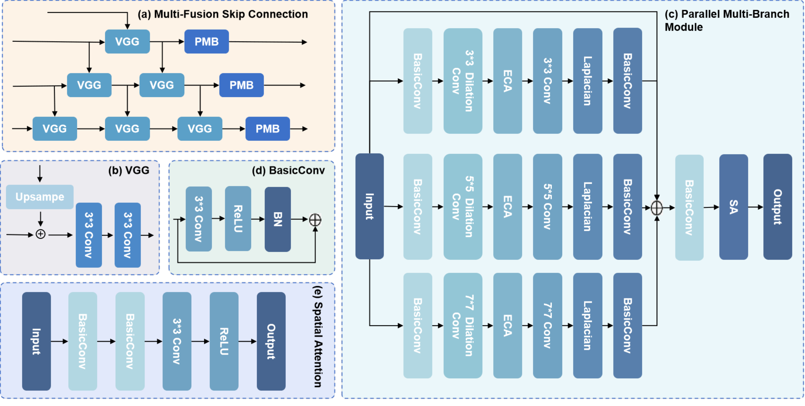
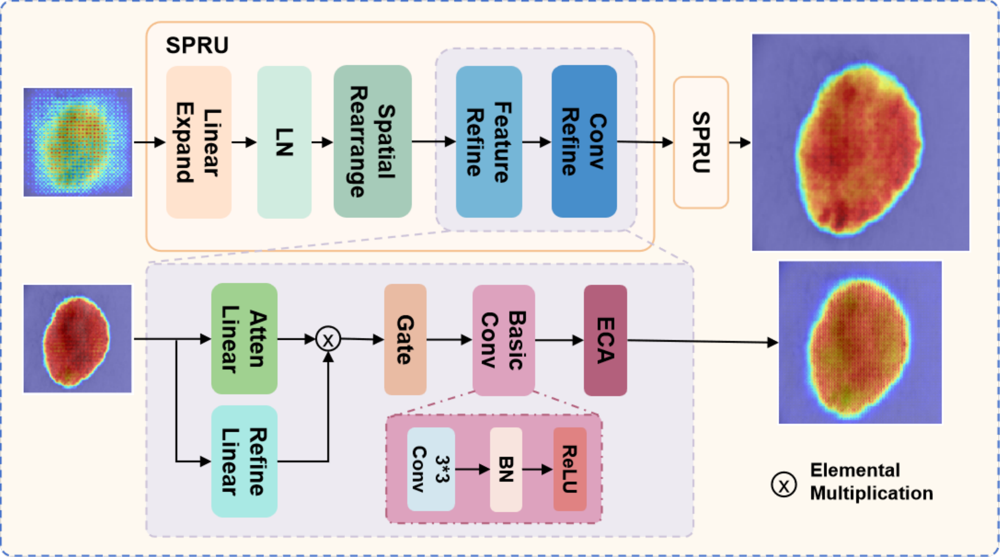
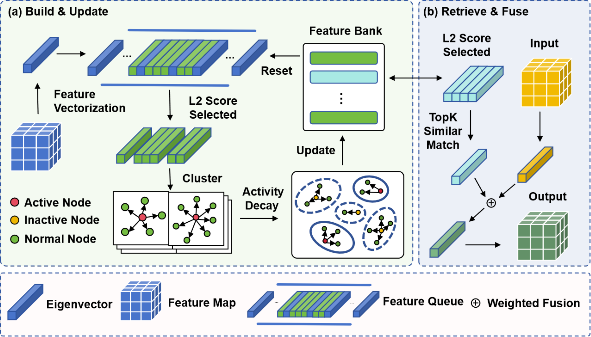
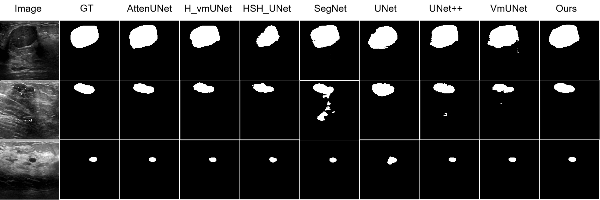
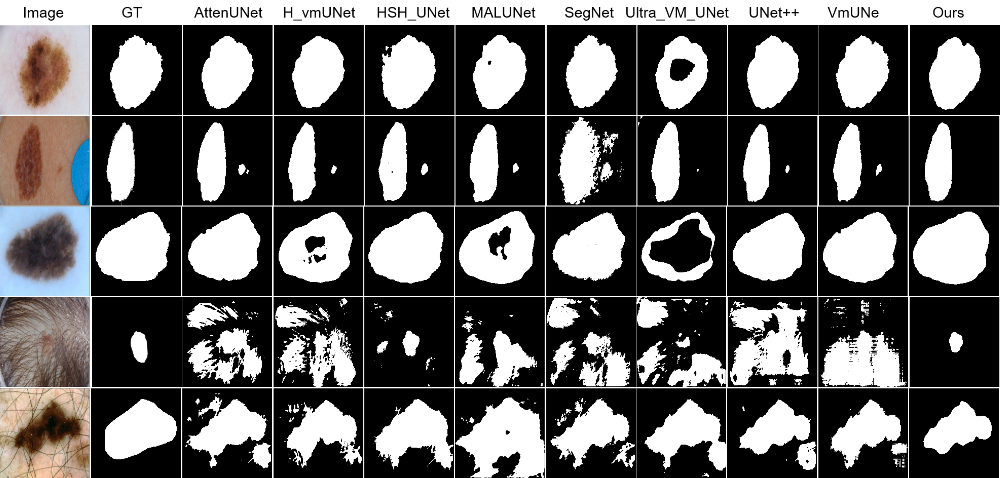
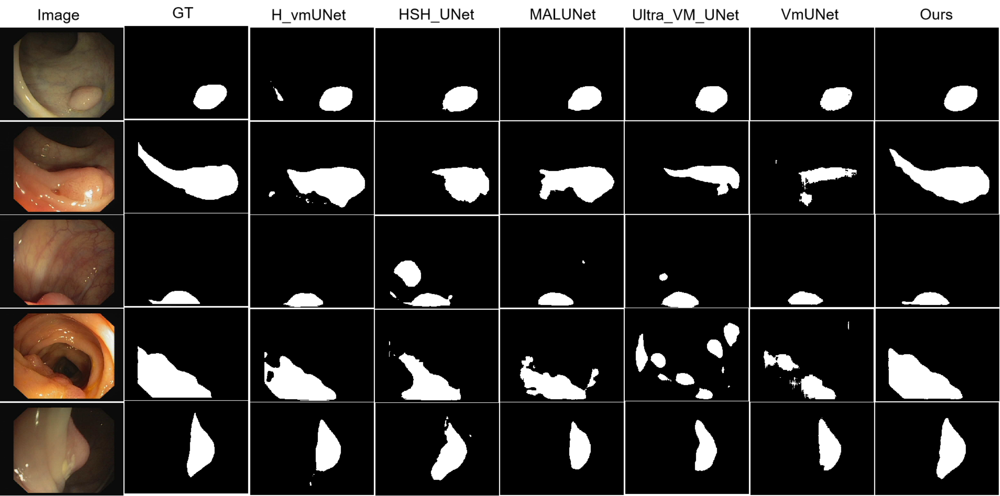
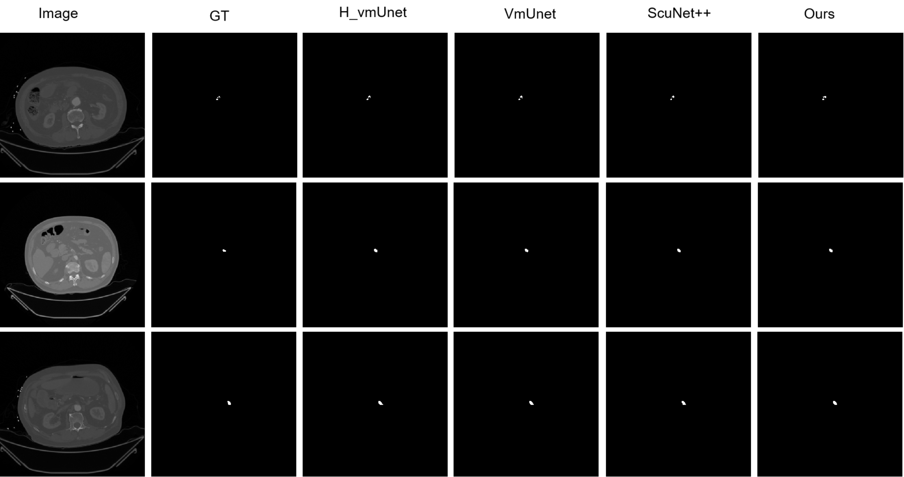
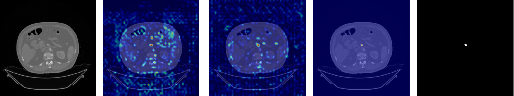

# **ProDyS: Self-Supervised Feature Learning with Prototype-Guided Context Fusion and Progressive Optimization**（ProDyS：结合渐进式动态优化和原型引导的自监督医学图像分割）

## **Abstract**（摘要）

Medical image segmentation plays a key role in improving the recognition of tissue structures and the accuracy of lesion detection, and places high demands on both the accuracy and the robustness of segmentation models. Current methods still struggle with three related problems: small-scale lesions are often missed, tissue boundaries are poorly delineated, and models adapt poorly to cross-domain scenarios. To address these issues, this paper proposes a self-supervised medical image segmentation method that combines progressive dynamic optimization with prototype-guided self-supervision. The method first introduces a gradient-parallel convolution scheme with heterogeneous branches; together with multi-scale feature enhancement, it strengthens the model's perception and expression of small targets, improves segmentation accuracy, and alleviates the problem of missed small-scale lesions. A mask-guided dynamic up-sampling method with an adaptive weight adjustment strategy then improves the continuity and clarity of predicted boundaries, mitigating the blurring of tissue boundaries. On this basis, a prototype-clustering-based self-supervised feature alignment strategy is established; by aligning the feature spaces of multi-source data distributions, it enhances the model's generalization and adaptability. Experimental results on public datasets (ISIC 2018, CVC_ClinicDB, and BUSI) and on the self-constructed SMAE dataset show that the proposed method achieves the best overall performance, confirming its effectiveness and providing a new technical direction for medical image segmentation.

**Keywords:** Medical image segmentation; multi-scale features; boundary optimization; self-supervised feature alignment

## **1** **Introduction**（引言）

Medical image segmentation has advanced considerably in recent years, yet it still falls short in dynamic multi-scale feature perception, geometric-structure consistency, and the stability of feature representation. These shortcomings translate into frequent missed detections and boundary misjudgments in clinical practice, compromising diagnostic accuracy and delaying treatment decisions. More accurate segmentation of critical anatomical structures would markedly reduce the risk of misdiagnosis and provide a more reliable basis for optimizing treatment pathways. In practice, however, precisely segmenting small or structurally complex lesions remains highly challenging even with advanced imaging techniques such as computed tomography angiography (CTA). Clinicians still face high rates of missed diagnosis and time-consuming analysis, highlighting a persistent gap between existing segmentation methods and the clinical demand for both accurate and efficient segmentation.

Current approaches to medical image segmentation are built mainly on two paradigms: convolutional neural networks (CNNs) and Transformers. Among CNN-based methods, U-Net and its variants (e.g., V-Net [1] and ResUNet [2]) laid the foundation for local feature extraction, and later studies extended this line with atrous convolution in the DeepLab series [3], attention mechanisms in Attention U-Net [4], and deep multi-scale fusion in UNet++ [5]. CNNs are nevertheless constrained by static convolution kernels and fixed local receptive fields: they cannot adequately capture the large variations in the scale and morphology of anatomical structures, so small lesions are frequently missed [2,4,6]; in addition, repeated down-sampling severely erodes high-frequency details and weakens boundary localization, producing blurred tissue contours [3,5,6]. Transformer-based methods overcome the receptive-field limitation of CNNs through global self-attention, as exemplified by the Vision Transformer (ViT) [7] and its medical adaptations such as TransUNet [8], Swin-Unet [9], and MedT [10]. However, self-attention models local spatial continuity and structural consistency only weakly [8,9], which likewise aggravates boundary blurring [10]. To mitigate this, structure-aware methods have recently introduced aggregation-aware modules and bidirectional edge generation that explicitly supervise the recovery of boundary details [11]. More recently, Mamba-based architectures have emerged as a promising alternative; for example, the selective multi-scale fusion Mamba proposed by Li et al. [12] retains long-range dependency modeling while alleviating the prohibitive computational cost of self-attention. That high cost, in turn, has forced input patching or early down-sampling in the encoding stage [7,9], which inevitably discards fine-grained information and limits the detection of small lesions [8,10]. Ultimately, both paradigms rely on static feature extraction and cannot adapt dynamically to cross-domain distribution shifts [6,8,9], so their performance degrades markedly in cross-domain scenarios. The three challenges identified above—insufficient detection of small-scale lesions, blurred tissue boundaries, and weak cross-domain adaptability—can be traced to the lack of mechanisms for small-target structure perception, boundary information preservation, and cross-domain dynamic adaptation.

On the basis of this analysis, medical image segmentation still faces three critical problems: insufficient detection of small-scale lesions, blurred tissue boundaries, and degraded adaptability across domains. The first problem stems mainly from a bottleneck in multi-scale feature fusion: high-resolution details are lost in deep features, and receptive-field design cannot easily balance global and local information, so small lesions tend to be suppressed during encoding. The second problem can be attributed to weak modeling of complex boundary geometry in the decoding stage and the absence of effective boundary-oriented supervision, which yields discontinuous and unclear predicted boundaries. The third problem arises because feature representations are sensitive to domain shift; without a domain-invariant feature learning mechanism, the model over-fits domain-specific nuisance information instead of focusing on the essential characteristics of the task.

To address these problems, this study proposes a multi-scale gradient-parallel feature enhancement method, a soft–hard mask-guided dynamic up-sampling mechanism, and a prototype-clustering-driven self-supervised feature alignment framework, which together improve multi-scale detail capture, boundary segmentation accuracy, and cross-domain generalization. The main contributions are as follows:

1. To improve the detection of small-scale lesions and the accurate capture of tiny targets and local details, we propose a multi-scale gradient-parallel feature enhancement method, Parallel Multi-Branch Enhancement (PMBE). Through three heterogeneous branches and gradient dilated convolution, it effectively strengthens the representation of detail features.

2. To address the blurring of tissue boundaries caused by up-sampling methods that lack anatomical constraints and therefore produce discontinuous boundaries, we design a soft–hard mask-guided dynamic up-sampling mechanism (SHD-UP). Combined with multi-level masks and an adaptive fusion strategy, it markedly improves the continuity and accuracy of boundaries.

3. To address the difficulty of adapting to inter-domain feature distribution differences and the resulting decline in generalization, we construct a prototype-clustering-driven self-supervised feature alignment framework (PCSA). With a dynamic feature bank and momentum updates, it achieves stable feature alignment and cross-domain generalization.

4. In the clinical scenario of superior mesenteric artery embolism, the proposed method achieves a Dice similarity coefficient (DSC) of 80.92% and a mean intersection over union (mIoU) of 69.32%, surpassing the best DSC baseline HVmUNet (79.14%) and the best mIoU baseline UltraVMUNet (68.80%), respectively. In addition, the method was systematically evaluated on several public datasets, including ISIC2018, BUSI, and CVC_ClinicDB, where the experimental results confirm its superiority in terms of performance, robustness, and cross-domain generalization.

The remainder of this paper is organized as follows. Section 2 reviews related work, Section 3 describes the proposed method, Section 4 presents the experiments and ablation study, and Section 5 concludes the paper.

## **2** **Related Work**（相关工作）

### **2.1** **Multi-Scale Feature Learning**（多尺度特征学习）

Medical image segmentation is widely used for lesion delineation, where the precise segmentation of tiny targets and complex boundaries is a key determinant of model performance. Multi-scale feature extraction, an important means of capturing both local and global information, has long been regarded as central to improving segmentation performance.

However, conventional multi-scale modeling often responds weakly to tiny targets and fine-grained structures, which limits its effectiveness in complex medical imaging. For instance, UNETR [13], proposed by Hatamizadeh et al., introduces Transformers into the encoder to strengthen global modeling. Although it performs well on large-scale structures, its heavy reliance on long-range dependencies leaves local edges and fine structures poorly characterized. As a result, small or low-contrast lesions are prone to missed detection or blurred edges, especially in tasks involving highly deformable anatomical structures.

To address the limitations of multi-scale feature extraction in U-Net-style models, some studies have introduced multi-scale feature fusion into feature pyramid structures [14]. TransUNet [8] by Chen et al. fuses multi-scale channel attention with local convolution and uses pyramid branches to capture and merge features at different scales, which effectively improves sensitivity to objects of varying scales. Even so, these methods are largely based on feature-level stacking and fusion and do not fundamentally resolve feature redundancy and information interference. When simple stacking or weighted fusion is applied to images with interleaved multi-scale lesions, blurred edges, or highly variable morphology, overlapping information and imbalanced contextual awareness tend to arise, further weakening the segmentation of tiny targets.

Atrous (dilated) convolution, a common means of enlarging the receptive field, is also widely used in medical image segmentation. Hai et al. [15] proposed a fully convolutional dense network that captures multi-scale contextual information using convolutions with different dilation rates, improving the segmentation of small targets such as breast masses. Owing to the inherent properties of dilated convolution, however, feature extraction can suffer from insufficient spatial resolution and grid effects, which tend to fragment local details or break edge information. Especially in high-resolution images, it is difficult to design the dilation rate and receptive field to preserve local details while maintaining global context, so small-target information is still extracted incompletely in practice.

With the rise of Transformers in vision, attention-based multi-scale modeling has become a popular research direction. TransUNet [8] by Chen et al. combines Transformers with U-Net to strengthen global-context modeling in medical image segmentation. However, when the self-attention mechanism processes local details, the introduced long-range dependencies can reduce sensitivity to small lesions; in medical images with highly uneven target-size distributions, the representation of fine structures tends to be overwhelmed by global information, leading to blurred features or distorted edges. Swin-Unet [9] by Cao et al. adopts a pure Transformer architecture that emphasizes local detail capture, yet it still adapts poorly to objects with large morphological variation. Sun et al. [16] point out that existing methods often disregard the dynamic relationship between anatomical priors and target morphology and thus fail to accommodate the diversity of target scale, shape, and spatial position in medical images; this shortcoming is particularly evident in the detection and segmentation of small lesions. To this end, AML-CT [17] unifies local and global features through cross-branch fusion, effectively refining the segmentation of small targets and complex boundaries.

Taken together, the literature indicates that poor detection of small lesions stems mainly from insufficient multi-scale feature fusion. This deficiency manifests as a loss of high-resolution details in deep features and a receptive-field design that cannot easily balance macroscopic and microscopic features, ultimately constraining feature representation.

### **2.2** **Edge-Aware Segmentation**（边缘感知分割）

Complex lesions in medical image segmentation are often accompanied by edge artifacts and morphological deformation, making inaccurate boundaries a prominent difficulty. The edge morphology of complex lesions is influenced by a variety of factors, including imaging noise, changes in scan parameters, and differences in the anatomical structure of the lesions themselves; the resulting artifacts and deformation seriously interfere with the model's ability to capture the true boundary. Conventional up-sampling approaches used in CNNs, such as deconvolution and bilinear interpolation, can gradually restore spatial resolution, but they lack prior constraints from anatomy, so boundary recovery loses detail and produces obvious distortion and aliasing effects. The CTO network proposed by Lin et al. [18] combines a CNN, a vision Transformer, and explicit edge-detection operators; through a boundary-guided decoder it markedly improves boundary detection accuracy, performing especially well on complex lesions.

To alleviate these problems, some studies have introduced constraint mechanisms based on morphology and boundary awareness to refine boundary modeling. DPGNet [19], proposed by Wang et al., adopts a three-stage progressive refinement strategy with an edge-difference attention module; it learns and quantifies boundary uncertainty adaptively without explicit boundary labels, substantially improving the accuracy of boundary recovery. Similarly, BGDNet [20] by Xu et al. introduces boundary extraction and boundary integration modules that explicitly exploit boundary features during decoding, directing the model to focus on lesion edges and improving the continuity and precision of predicted boundaries.

However, these methods often rely on hand-crafted morphological operators or explicit boundary supervision and may generalize poorly to highly deformed regions or complex artifacts. BACANet [21] by Wu et al. combines convolutional attention with a boundary-aware strategy and performs well in real-time liver ultrasound segmentation, but its performance on multi-modal or large-scale datasets still requires further validation.

In addition, boundary refinement techniques based on graph neural networks and conditional random fields have been introduced into medical image segmentation to compensate for the limitations of conventional up-sampling. Yu et al. [22] combined a conditional random field (CRF) post-processing module to refine segmentation boundaries at a fine granularity; by imposing spatial and appearance consistency constraints, they effectively reduce the influence of artifacts and improve boundary continuity.

In summary, blurred tissue boundaries fundamentally arise because decoders model complex boundary geometry only weakly and lack effective boundary-oriented supervision, yielding discontinuous and unclear predicted boundaries. Existing methods struggle to strengthen geometric modeling while constraining spatial information recovery during up-sampling; a mechanism that jointly optimizes boundary reconstruction and boundary supervision is therefore needed.

### **2.3** **Feature Generalization Capability**（特征泛化能力）

In medical image segmentation, the limitations of fixed feature representations have increasingly become a major bottleneck for model generalization. Lesions in medical images are highly heterogeneous in morphology, size, location, and contrast, and data acquired from different patients, different scanners, or even different time points exhibit marked differences in feature distribution. This diversity makes it difficult for segmentation models based on fixed feature extractors to adapt to the prototype distributions of all samples; in cross-device, cross-modality, and few-shot tasks in particular, generalization performance degrades markedly [23].

To break through the bottleneck of fixed feature representations, some studies have introduced dynamic feature adjustment mechanisms that allow a network to adapt its representation strategy to the feature distribution of the input. Chen et al. [24] proposed a conditional convolution method that dynamically generates convolution kernel parameters, enabling adaptive responses to different feature prototypes and improving the model's ability to represent diverse lesions. Yang et al. [25] further proposed a conditional-convolution-based network that exhibits more stable performance under data distribution shifts in medical image segmentation. Nevertheless, this approach depends on a complex parameter-generation network, and training stability and computational cost constrain its large-scale application. Moreover, under extreme distribution shifts, dynamic convolution may still be limited by the representativeness of the training samples, so the effect of dynamic adjustment remains limited.

Another line of work focuses on multi-modal alignment in feature space and feature prototype learning. Song et al. and Wu et al. improved model adaptability in few-shot or cross-domain tasks through interactive prototype learning and distributed contrastive learning frameworks, respectively [26,27]. Such methods, however, usually depend on a clear definition of prototype categories and stable feature clustering; for highly heterogeneous lesions within a category, prototype boundaries may remain ambiguous or categories may overlap, which affects segmentation accuracy.

Transformers and their variants provide a new avenue for dynamic adaptation of feature representations. The dynamic multi-head self-attention mechanism proposed by Zhao et al. [28] achieves differentiated feature encoding of different lesion regions through weight sharing and conditional adjustment; it adaptively adjusts the attention distribution according to image content and thus captures diverse feature prototypes more effectively. However, Transformer architectures generally have a large number of parameters and require large amounts of training data, and their adaptability to few-shot or severely biased distributions in medical images still needs further validation. In addition, the smoothing nature of attention mechanisms makes it difficult to highlight fine details. Wang et al. [29] further proposed a multi-dimensional Transformer with an attention filtering mechanism that extends self-attention to both spatial and channel dimensions, enhancing feature representation. Collectively, this literature indicates that the decline in cross-domain performance stems primarily from the absence of a domain-invariant feature learning mechanism: the model over-relies on domain-specific nuisance information and fails to learn the general essence of features.

## **3** **Method**（方法）

### **3.1** **Overview**（总体概述）

**Fig. 1.** Overall architecture of the proposed ProDyS.（总体架构图）

As illustrated in Fig. 1, we propose ProDyS, a self-supervised medical image segmentation method that integrates a progressive dynamic optimization strategy with a prototype-guided mechanism. The method first preprocesses the input data through feature extraction. Multiple parallel Transformers then extract multi-level features, coupled with prototype-clustering-based self-supervised learning for deep feature representation learning. A multi-level feature interaction mechanism subsequently enhances the model's representational capacity, while dynamic feature optimization is introduced at intermediate layers to reinforce key information. Finally, progressive multi-scale feature fusion efficiently integrates feature representations across levels and channels to produce a comprehensive feature representation, which effectively improves the model's performance and robustness in complex medical image segmentation tasks. Without compromising computational efficiency, the architecture achieves an organic combination of deep perceptual ability and broad feature coverage.

### **3.2** **Feature Enhancement by Fusing Multi-Scale Saliency Contextual Information**（融合多尺度显著性上下文信息特征增强）

To address the common challenges in medical image analysis—small-scale lesions that are easily missed, tiny targets that are neglected, and fine local structures that are difficult to capture precisely—this study proposes a feature enhancement strategy that fuses multi-scale salient contextual information. Specifically, we design the PMBE method, a multi-scale gradient-parallel feature enhancement approach whose core lies in constructing three heterogeneous feature extraction branches with a dilated convolution mechanism. By processing feature information at different scales and receptive fields in parallel, PMBE effectively fuses highly discriminative contextual cues and substantially strengthens the network's ability to represent subtle structures and low-contrast targets, markedly improving the accuracy and robustness of small-scale lesion and local-detail recognition.

**Fig. 2.** Overall framework of the PMBE module: (a) multi-feature fusion skip connection, (b) VGG, (c) overall PMBE structure, (d) basic convolution block, (e) spatial attention.（PMBE总框架图 (a)多特征融合跳跃连接 (b)VGG (c)PMBE总结构 (d)basicConv (e)空间注意力）

As shown in panel (a) of Fig. 2, the proposed multi-fusion skip connection is a key architectural design for addressing information loss in deep networks. Compared with the single skip connection of a conventional U-shaped network, this architecture implements a multi-level, multi-path feature transmission and fusion strategy. Specifically, during encoding the network extracts and preserves feature maps at every level; during decoding these feature maps are selectively fused across levels. Crucially, the network employs multiple VGG modules (panel (b)) to handle feature fusion at different levels of abstraction, thereby constructing a rich set of skip-connection pathways. This multi-level fusion markedly improves detail reconstruction and effectively alleviates the feature-semantic inconsistency that arises when low-level features are transferred directly to high-level semantic layers in traditional skip connections.

Each VGG module consists of two consecutive convolution operations, each followed by batch normalization and a ReLU nonlinear activation, forming a standardized feature extraction unit. By adapting the input channel numbers of different VGG modules, the network flexibly processes features originating from different depths. This cascaded design ensures that high-resolution spatial details from shallow layers and strong semantic information from deep layers are effectively fused, ultimately yielding more discriminative comprehensive feature representations.

The parallel multi-branch scheme in panel (c) consists of three parallel branches, each with a distinct convolutional parameter configuration to focus on features at a particular scale. Although the three branches share a similar sequence of components, their differing dilation rates and kernel sizes enable multi-scale feature representation. This parallel design allows the network to integrate information from different receptive-field ranges simultaneously, substantially improving its ability to analyze complex scenes:

$$
S = \sum_{i=1}^{3} B_i(x)
\tag{1}
$$

where $B_i$ denotes the $i$-th branch and $S$ is the fused branch sum.

Specifically, each PMBE block contains three parallel branches with similar structures but independent parameters to achieve differentiated feature extraction. Each branch proceeds as follows: an initial feature transformation is performed by a basic convolution unit (panel (d)); a convolution with a specific dilation rate then enlarges the receptive field; a channel attention mechanism models inter-channel dependencies; convolutional kernels of different sizes further enrich the feature representation; finally, a Laplacian edge enhancement layer strengthens edge perception, and another basic convolution unit refines the features. Because the Laplacian kernel effectively extracts second-order derivative information, it highlights edge and texture details. By integrating a Laplacian convolution to reinforce edge features, this design substantially enhances the expression of edge information while preserving the original features, improving the model's perception of target boundaries—an important property for precise segmentation:

$$
L = K_{\mathrm{Laplacian}} \ast x
\tag{2}
$$

$$
K_{\mathrm{Laplacian}} = \begin{bmatrix} 0 & 1 & 0 \\ 1 & -4 & 1 \\ 0 & 1 & 0 \end{bmatrix}
\tag{3}
$$

where $K_{\mathrm{Laplacian}}$ is the Laplacian convolution kernel, $x$ is the input feature, and $L$ is the output feature.

A further key advantage of the parallel multi-branch architecture is its efficient information flow. Because every branch is directly connected to both the input and the output, gradients can back-propagate along multiple paths, which effectively mitigates the vanishing-gradient problem in deep networks. Meanwhile, the complementary features captured by different branches are integrated through a fusion strategy to produce richer, more robust representations. The fusion strategy of the PMBE block is as follows: the outputs of all branches are first summed element-wise; the branch outputs are then concatenated along the channel dimension and processed by a dimensionality-reduction convolution; finally, a residual connection is incorporated to construct multi-level fused features.

The basic convolution block consists of a convolutional layer, batch normalization, and a ReLU activation. As a component of the PMBE block, the efficient channel attention (ECA) mechanism models inter-channel dependencies efficiently with one-dimensional convolution. Unlike conventional channel attention, ECA avoids dimensionality reduction and restoration, substantially reducing the number of parameters while preserving attention performance. The mechanism first compresses the spatial dimension with global average pooling, then applies a 1D convolution to capture local inter-channel dependencies, and finally generates channel weights through an activation function. This lightweight design makes it suitable for resource-constrained environments. The global average pooling formula is as follows:

$$
g_c = \frac{1}{H \times W} \sum_{i=1}^{H} \sum_{j=1}^{W} x_c(i,j)
\tag{4}
$$

where $g_c$ denotes the output scalar of the $c$-th channel, $x_c(i,j)$ is the feature value at spatial position $(i,j)$ of the $c$-th channel in the input feature map, $H$ and $W$ are the height and width of the feature map, $c$ is the channel index, and $i$ and $j$ index the vertical and horizontal spatial coordinates. The formula compresses the two-dimensional feature map into a channel descriptor vector by averaging over all $H \times W$ spatial positions.

The spatial attention module shown in panel (e) enhances information selection along the spatial dimension. It first extracts spatial contextual information with two consecutive convolutional layers, then generates a spatial attention map, and finally multiplies the map element-wise with the original feature map to achieve adaptive enhancement in the spatial dimension. Spatial attention allows the network to dynamically focus on important regions of the input, suppress irrelevant background, and improve the relevance and effectiveness of features.

The final output of the PMBE block passes through spatial attention for comprehensive feature enhancement. The combination of channel and spatial attention ensures that the network optimizes feature representation jointly from different dimensions, improving the precision and efficiency of visual task processing. Structurally, PMBE resembles atrous spatial pyramid pooling (ASPP) [3] in its parallel multi-branch design, but differs in two respects. First, the branches of ASPP share the same kernel size and differ only in dilation rate, whereas the three branches of PMBE are heterogeneous in kernel size, dilation rate, and attention configuration, so their response patterns are complementary. Second, the Laplacian convolution layer at the end of each PMBE branch (Eqs. 2–3) explicitly injects edge-gradient information into the segmentation task, a design that ASPP lacks.

### **3.3** **Progressive Dynamic Weight Optimization Based on Mask-Guided Constraints**（基于掩码引导约束的渐进式动态权重优化）

Within ProDyS, we propose the SHD-UP mechanism, a soft–hard mask-guided dynamic up-sampling approach. The mechanism uses the multi-scale features generated during decoding to guide the formation of soft masks and adopts a progressive fusion strategy, effectively enhancing the representational capacity of up-sampled features. Its core function is to progressively restore the low-resolution, high-semantic feature maps extracted from deep layers to the original input size, refining the features along the way and ultimately producing high-precision segmentation results. This design effectively alleviates the detail loss and boundary blurring commonly observed in conventional up-sampling methods.

**Fig. 3.** Structure of the SHD-UP module.（SHD-UP结构）

The up-sampling method first acquires multi-scale features by collecting feature representations from each level of the decoder. These decoder feature maps of different scales are uniformly resized to the target output resolution, and their key information is preliminarily extracted to produce a set of resolution-unified feature masks that serve as the basis for the subsequent attention mechanism and feature fusion. Feature maps at different levels carry information at different levels of abstraction: deep features contain rich semantic information and category-discrimination ability, whereas shallow features retain more spatial detail and texture information. By integrating multi-scale features, the model achieves a balance between semantic understanding and spatial precision, which is essential for high-accuracy segmentation. In parallel, the main input feature tensor is reshaped and transposed to initialize a guided feature map that acts as the carrier for the subsequent multi-scale information fusion:

$$
M_k = \mathrm{Resize}\left(F_k^{\mathrm{dec}}\right), \quad k \in \{1, 2, \ldots, L\}
\tag{5}
$$

where $M_k$ is the resolution-unified feature mask of the $k$-th layer and $\mathbf{F}_k^{\mathrm{dec}}$ is the decoder feature of the $k$-th layer.

The multi-scale adaptive attention fusion mechanism processes the prepared multi-scale feature masks iteratively, building a complete attention computation framework that considers both the channel and spatial dimensions. In each iteration, for a mask at a specific scale, an average pooling operation with a dynamic kernel size is first applied for smoothing, suppressing noise and enhancing local consistency. Three types of attention maps are then generated in parallel: channel attention, spatial attention, and edge attention. Channel attention computes the global channel mean of the smoothed mask and combines it with learnable weights to produce a weight vector that emphasizes informative feature channels. Spatial attention computes the ratio of the smoothed mask to its global mean and, combined with another set of learnable weights, generates an attention map that highlights spatially salient regions. Edge attention computes the gradient magnitude of the smoothed mask using a predefined, cached Sobel operator and, combined with a third set of learnable weights and a sigmoid activation, produces an attention map focused on object-boundary regions—a design that is particularly suited to applications such as medical imaging that demand high contour accuracy. Because the three attention mechanisms are generated in parallel, the method captures key information from different dimensions, and their complementary effects comprehensively enhance feature representation. The edge attention $\mathrm{EA}$ is computed as follows:

$$
EA = \sigma\left(W_e \ast \left|\nabla_{\mathrm{sobel}} \otimes M_k\right|\right)
\tag{6}
$$

where $\nabla_{\mathrm{sobel}}$ is the predefined Sobel operator, $M_k$ is the smoothed feature mask, $W_e$ denotes learnable weights, $\sigma$ is the sigmoid activation function, and $\otimes$ and $\ast$ denote the convolution operation and the subsequent convolution computation, respectively.

To further refine useful information and suppress irrelevant background, the method adopts a dynamic adaptive threshold filtering strategy. Unlike conventional fixed-threshold methods, it derives a dynamic confidence threshold from the statistical properties of the mask currently being processed and from iteration-varying baseline and scaling factors controlled by learnable parameters. Specifically, the method extracts the mean and standard deviation of the feature map and combines them with learnable parameters to compute an adaptive threshold that filters out low-confidence regions. Only positions whose smoothed-mask value exceeds this threshold are deemed reliable, yielding a filtered mask. This step effectively concentrates on high-confidence foreground regions. All generated attention components, the original masks, the filtered masks, and the associated statistics are stored together for the subsequent fusion stage. Because the threshold is adjusted automatically according to the distribution of the input data, this adaptive mechanism markedly improves the model's adaptability to different scenarios. The dynamic threshold filtering formula is as follows:

$$
\mathrm{threshold} = \mu_x + \left(\beta + \gamma \cdot i\right) \cdot \sigma_x
\tag{7}
$$

where $\beta$ is a base threshold that prevents noise interference (a larger value gives stricter filtering) and $\gamma$ is a level-wise scaling factor that controls the threshold decay rate at different network depths.

The feature fusion and optimization process is likewise iterative, progressively refining the guided feature map. The method initializes an accumulated attention map and updates it in each iteration. At the beginning of an iteration, a level-wise importance weight is computed from the current scale and learnable parameters; a learnable decay factor controls the retention ratio of historical information, producing a smooth transition of attention information. This design allows the model to adapt to new feature representations while preserving critical historical information, thereby enhancing consistency. To keep spatial predictions coherent, a spatial consistency constraint is introduced that harmonizes the predictions of adjacent regions through local averaging. A feature selection mechanism then applies different degrees of enhancement to different regions according to their attention weights: high-attention regions receive larger enhancement coefficients, whereas low-attention regions remain relatively unchanged. This selective enhancement concentrates computational resources on key regions, improving the relevance and effectiveness of feature representation. The integration of global contextual information substantially improves semantic understanding: the previously generated channel, spatial, and edge attention maps are multiplied by the corresponding level-wise importance weights or their own learnable weights and combined into a comprehensive attention weight map, which is then normalized to ensure validity. Global average pooling extracts a global representation of the feature map, which is expanded to the original size and fused with local features. This design establishes connections between distant pixels, alleviating the shortage of contextual information caused by the limited receptive field.

For feature up-sampling, the method adopts a progressive scheme instead of direct magnification. Progressive up-sampling proceeds in two stages: a two-fold up-sampling followed by feature refinement, and then a second two-fold up-sampling. Each stage comprises feature expansion, shape rearrangement, and feature refinement, interspersed with complex feature processing and information fusion. This progressive strategy reduces the information distortion caused by a single large up-sampling step and improves up-sampling quality, especially for complex textures and fine structures. The skip-connection mechanism is also exploited extensively: low-level features from the encoder are introduced into the decoding process, first reduced in resolution by pooling, then adjusted in channel number by channel adaptation, and finally restored to the target size by bilinear interpolation. The low-level and current features are fused through a gating mechanism whose gating coefficients are learned automatically by the network. This design embodies the complementary use of deep and shallow features and effectively alleviates information attenuation in deep networks. In parallel, the method performs a direct four-fold up-sampling of the initially fused features; the results of the direct and progressive paths are then combined by a weighted sum with two learnable blending weights. This multi-path fusion mechanism retains the outputs of both the conventional and the progressive up-sampling paths. Drawing on the idea of ensemble learning, it exploits the strengths of different up-sampling strategies and further improves the model's generalization and robustness. Both SHD-UP and the gated up-sampling of Attention U-Net [4] use attention to guide feature recovery. They differ in that Attention U-Net generates a single gated spatial attention map, whereas SHD-UP produces channel, spatial, and edge attention in parallel at every level, with the edge attention derived from Sobel-based gradient magnitudes modulated by learnable weights (Eq. 6). In addition, SHD-UP replaces the fixed gate with a dynamic threshold driven by feature statistics (Eq. 7), so that the foreground decision decays adaptively with network depth.

### **3.4** **Self-Supervised Feature Alignment Based on Prototype Clustering**（基于原型聚类的自监督特征对齐）

Within ProDyS, PCSA provides a new feature enhancement paradigm for medical image segmentation through the joint optimization of deep representation learning and model clustering.

The core of this mechanism is a dynamically evolving dictionary of feature prototypes that continuously tracks the intrinsic distribution of target anatomical structures in feature space, effectively mitigating the intra-class dispersion and inter-class confusion caused by morphological variation in traditional methods. The set of cluster prototypes maintained by the system can be viewed as anchor points in the high-dimensional feature space, with each prototype representing the typical feature pattern of a particular category. These prototypes are updated by an exponential moving average strategy: for each feature vector extracted by the network, its similarity to the existing prototypes is computed, and the position of the matched prototype is adjusted through a momentum-based update. This mechanism allows the prototype dictionary to adapt to the complex anatomical variations found in medical images. For example, in cases of mesenteric artery embolism, the system automatically evolves several sub-prototypes corresponding to lesion regions with different density and morphological characteristics, substantially improving the representation of heterogeneous lesions.

**Fig. 4.** Architecture and workflow of the FeatureBank.（FeatureBank的架构流程）

As a key innovative component inserted into the Swin Transformer layers, the feature bank markedly enhances the model's representational capacity and generalization by establishing efficient mechanisms for feature memory, clustering, and fusion. As shown in panel (a) of Fig. 4, the feature bank is responsible for feature vectorization, clustering, and feature enhancement. Through a conversion mechanism from short-term to long-term memory, it enables the network to retain and exploit historical feature information, improving its ability to recognize complex patterns. The value of the feature bank lies in three aspects. First, it constructs a feature memory mechanism that stores historical features in feature queues and clustering centers. Second, it achieves adaptive feature enhancement, retrieving and fusing features to generate more discriminative representations. Third, it optimizes small-object processing, concentrating resources on critical regions through region partitioning and importance assessment. From a systematic perspective, the feature bank is tightly coupled with the down-sampling path of the model: by capturing and refining feature representations at key points of hierarchical transition, it provides the whole network with a richer and more discriminative feature foundation.

The workflow of the feature bank begins with the management of the feature queue, which involves collecting, storing, and dynamically updating features. In the implementation, the feature queue uses a ring-buffer design with an efficient first-in, first-out update strategy. When a new batch of features arrives, the feature bank performs a queue update: the input features are first randomly sampled to control the computational burden, and the sampled features are then written to appropriate positions in the queue. To ensure numerical stability, all feature vectors are converted to a uniform precision, and asynchronous operations further improve update efficiency. As the underlying data structure of the feature bank, the feature queue not only supplies samples for updating the clustering centers but also implicitly builds a memory of historical features, allowing the network to accumulate knowledge over time. The update frequency of the feature queue is controlled by a dedicated parameter; a full update is usually performed only every few iterations to balance computational efficiency and feature freshness.

Based on the accumulated feature queue, the feature bank extracts representative clustering centers with an adaptive K-means algorithm. These centers serve as feature prototypes and are configured adaptively according to the feature dimension. The clustering process uses a momentum update mechanism that smooths the evolution of the centers while dynamically adjusting the number of effective centers to fit the sample distribution. To capture feature patterns at different scales, the algorithm also combines batch processing with feature selection, prioritizing features with large norms to improve clustering quality. Because the quality of the clustering centers directly affects feature fusion, the feature bank introduces an activity-tracking mechanism that monitors the usage of each center and periodically resets inactive centers, ensuring that all centers remain effectively utilized. The momentum update of a clustering center is given by:

$$
c^{(t)} = \beta \cdot c^{(t-1)} + (1 - \beta) \cdot \frac{1}{|B|} \sum_{x \in B} x
\tag{8}
$$

where $\beta \in [0,1)$ is the momentum coefficient and $B$ is the set of features in the current batch.

One of the core functions of the feature bank is feature retrieval, that is, finding the most similar clustering center for an input feature. The retrieval process first computes cosine similarity after feature normalization and then selects the $k$ clustering centers with the highest similarity. To improve retrieval efficiency, the feature bank implements several optimizations: a similarity cache that records already-computed results by hash values to avoid redundant computation; a sparse computation strategy that processes only important features with large norms; and an active-center filter that considers only highly active clustering centers. For large batches, random sampling is also used to reduce the computational burden. To further accelerate large-scale retrieval, specialized indexing techniques are integrated that automatically select the most appropriate index type according to the size of the feature set. Together, these measures ensure that feature retrieval remains efficient and accurate even with a large number of features. The cosine similarity between a query feature and a clustering center is computed as:

$$
\mathrm{sim}(q, k_i) = \frac{q \cdot k_i}{\|q\| \cdot \|k_i\|}
\tag{9}
$$

where $q$ is the query feature and $k_i$ is the $i$-th clustering center.

The attention weights are computed as:

$$
w_i = \frac{\exp(s_i / T)}{\sum_{j} \exp(s_j / T)}
\tag{10}
$$

The similarities are normalized with a softmax function.

The residual fusion is given by:

$$
q_{\mathrm{final}} = \alpha \cdot q_{\mathrm{original}} + (1 - \alpha) \cdot q_{\mathrm{fused}}
\tag{11}
$$

where $\alpha \in [0,1]$ is a learnable fusion weight.

The feature fusion is computed as:

$$
q_{\mathrm{fused}} = \sum_{i=1}^{K} w_i \cdot v_i
\tag{12}
$$

where $v_i$ is the feature vector corresponding to the $i$-th clustering center.

The reliability update is given by:

$$
r^{(t)} = \mu \cdot r^{(t-1)} + (1 - \mu) \cdot \frac{N_{\mathrm{assign}}}{\tau}
\tag{13}
$$

where $\mu$ is the momentum coefficient, $N_{\mathrm{assign}}$ is the number of samples assigned to this cluster, and $\tau$ is a normalization coefficient.

After retrieval, the feature bank generates enhanced features by combining the original features with the retrieved clustering centers in a weighted manner. The fusion process first computes a weight for each clustering center from multiple factors—similarity, reliability, and activity—where similarity reflects how well a feature matches a center, reliability measures the sample support of a center, and activity indicates how frequently a center is used. The weights are normalized with a softmax whose temperature parameter controls the smoothness of the distribution, and the weighted sum is then computed efficiently with batch matrix multiplication. To balance the contributions of the original and enhanced features, an adaptive fusion coefficient is used that starts small and increases gradually as the feature bank is trained. The reliability-weighted similarity is computed as:

$$
s_i = \mathrm{sim}(q, k_i) \cdot r_i^{(\lambda)}
\tag{14}
$$

where $r_i^{(\lambda)}$ is the reliability index of the $i$-th clustering center and $\lambda$ is the reliability decay coefficient.

The temperature is adjusted dynamically as:

$$
T = T_0 \cdot \left(1 + \gamma \cdot \mathrm{entropy}(s)\right)
\tag{15}
$$

where $T_0$ is the base temperature, $\gamma$ is an adjustment coefficient, and $\mathrm{entropy}(s)$ is the entropy of the similarity distribution.

To better handle features at different scales and, in particular, to improve small-target recognition, the feature bank implements a region-optimized processing mechanism. The feature map is first divided into several regions, and an importance metric is computed for each region and normalized to highlight the differences among regions. Based on an importance threshold—optimized to balance detection rate and precision—the feature bank identifies and prioritizes key regions that are likely to contain small targets. The region masks are then expanded into pixel-level masks that selectively activate feature-bank processing. This strategy allows the feature bank to concentrate resources on the most informative regions while maintaining computational efficiency, markedly improving sensitivity to small targets and fine details. Experiments show that this mechanism is particularly effective in complex scenes containing multi-scale targets, helping the model capture and retain subtle yet important features and thereby providing richer representations for subsequent classification or segmentation tasks.

## **4** **Experiments**（实验）

### **4.1** **Datasets**（数据集）

#### **4.1.1** **Public Datasets**（公开数据集）

To comprehensively demonstrate the performance of the proposed model, we validated our method on the BUSI, ISIC2018, and CVC_ClinicDB public datasets as well as on the self-constructed SMAE dataset.

The BUSI dataset was collected in 2018 and contains breast ultrasound images from 600 women aged 25 to 75. It comprises 780 PNG images with an average size of 500×500 pixels.

ISIC2018, the publicly available skin-lesion segmentation dataset from the 2018 International Skin Imaging Collaboration challenge, contains 2,694 dermoscopic images with segmentation-mask labels. The dataset is split at a ratio of 7:3 for training and testing; specifically, the training set contains 1,886 images and the test set contains 808 images.

CVC_ClinicDB is another public benchmark dataset containing polyp images for polyp segmentation. It includes 612 different polyp images with a size of 384×288.

#### **4.1.2** **Self-Constructed Dataset**（自建数据集）

The self-constructed dataset used in this study was collected between 2024 and 2025 and consists mainly of CT images of superior mesenteric artery embolism. The dataset contains 626 images with an average size of 512×512. All images underwent uniform acquisition and preprocessing and were annotated by professionals; the dataset can be used for training and evaluating segmentation models.

### **4.2** **Evaluation Metrics**（评价指标）

To evaluate the effectiveness of our method for medical image segmentation, we adopt two widely used metrics: Intersection over Union (IoU) and Dice similarity coefficient (DSC). These metrics provide a comprehensive assessment of our model's performance.

IoU quantifies the overlap between the predicted region and the ground-truth region:

$$
IoU = \frac{TP}{TP + FP + FN}
\tag{16}
$$

DSC measures the similarity between the predicted segmentation and the ground-truth segmentation:

$$
DSC = \frac{2TP}{2TP + FP + FN}
\tag{17}
$$

Here, TP denotes the number of correctly predicted positive samples, TN the number of correctly predicted negative samples, FP the number of incorrectly predicted positive samples, and FN the number of incorrectly predicted negative samples. All metrics are dimensionless and can reliably evaluate the segmentation performance of the model.

### **4.3** **Implementation Details**（实验细节）

The models were trained with the stochastic gradient descent (SGD) optimizer with an initial learning rate of 1×10⁻⁴, momentum of 0.9, weight decay of 1×10⁻⁴, a minimum learning rate of 1×10⁻⁵, and a batch size of 8. Training was performed for 200 epochs on an NVIDIA GeForce RTX 4090D GPU with 24 GB of memory. All input images were uniformly resized to 224×224 pixels and augmented with random cropping and rotation.

### **4.4** **Experimental Analysis**（实验分析）

#### **4.4.1** **Public Datasets**（公开数据集）

##### **BUSI Dataset**（BUSI数据集）

Our proposed model achieves an 81.63% DSC on the BUSI dataset, surpassing all competing models, including the strongest alternatives. For example, SMM-UNet [12], a recently proposed hybrid architecture, attains a high DSC of 81.12%; EMCAD [37], which improves the baseline with spatial attention mechanisms, reaches 80.25%; and MLFEU-NET [30], which exploits multi-scale feature fusion, achieves 80.36%. Fig. 5 provides a visual comparison of the predicted masks.

**Fig. 5.** Qualitative comparison on the BUSI dataset.（BUSI数据集上对比实验）

From left to right, the images show the original image and the segmentation results of different models, including Att-UNet [4], H_vmUNet [31], HSH_UNet [32], SegNet [33], U-Net [6], UNet++ [5], VmUNet [34], our method (Ours), and the ground truth as reference. Overall, Att-UNet [4] exhibits basic segmentation capability, but its results have blurred boundaries and contain missing or redundant regions. H_vmUNet [31] performs slightly better, with more concentrated segmentation regions, though its accuracy remains insufficient. HSH_UNet [32] produces more compact results but still lacks detail, especially in edge smoothness. SegNet [33] yields relatively coarse results with irregular region shapes and noticeable noise. By comparison, U-Net [6] produces more complete segmentations but with insufficient boundary precision and slight over-segmentation. UNet++ [5] achieves markedly better results, with contours closer to the truth and clearer boundaries, although minor errors remain. VmUNet [34] performs well, with contours close to the truth and appropriate detail handling, but slightly incomplete coverage in some regions. Our method (Ours) performs best among all the models: its segmentation regions are the closest to the ground truth, with clearer boundaries and better detail preservation.

In this study, we compare our method with more than ten state-of-the-art architectures known for their effectiveness in medical image analysis. The selected models include U-Net [6], Att-UNet [4], UNet++ [5], HSH_UNet [32], SegNet [33], TransUNet [8], FCBFormer [35], H_vmUNet [31], VmUNet [34], U-KAN [36], EMCAD [37], MSAByNet [38], MLFEU-NET [30], SMM-UNet [12], and WKPNet [39]. These architectures were carefully selected based on their proven performance in complex image recognition tasks and their suitability for medical applications. Their distinct structural designs provide a comprehensive basis for evaluating and comparing their capabilities within the context of this study.

**Table 1.** Quantitative comparison on the BUSI dataset.（表1 BUSI数据集上对比实验）

| Model | DSC↑ |
|---|---|
| U-Net [6] (2015) | 74.90 |
| Att-UNet [4] (2018) | 78.14 |
| UNet++ [5] (2018) | 75.74 |
| SegNet [33] (2017) | 75.07 |
| TransUNet [8] (2021) | 79.35 |
| FCBFormer [35] (2022) | 80.66 |
| HSHUNet [32] (2024) | 77.24 |
| H_vmUNet [31] (2025) | 77.20 |
| VmUNet [34] (2024) | 78.32 |
| U-KAN [36] (2025) | 76.95 |
| EMCAD [37] (2024) | 80.25 |
| MSAByNet [38] (2025) | 79.42 |
| MLFEU-NET [30] (2025) | 80.36 |
| SMM-UNet [12] (2025) | 81.12 |
| WKPNet [39] (2026) | 78.07 |
| **Ours** | **81.63** |

As shown in Table 1, ProDyS achieves an 81.63% DSC on the BUSI dataset, 0.51 percentage points higher than the runner-up method SMM-UNet (81.12%). This advantage mainly stems from the systematic improvements in detail modeling, boundary recovery, and cross-domain alignment: the PMBE module strengthens small-scale feature representation, the SHD-UP mechanism improves boundary continuity, and the PCSA framework enhances cross-domain generalization.

##### **ISIC2018 Dataset**（ISIC2018数据集）

From left to right, the images show the original image and the segmentation results of different models on skin-lesion regions, including Att-UNet [4], H_vmUNet [31], HSH_UNet [32], MALUNet [40], SegNet [33], UltraVMUNet [41], UNet++ [5], VmUNet [34], UNeXt [42], CMUNeXt [43], MSHVNet [44], GL-Net [45], our method (Ours), and the ground truth as reference. Overall, Att-UNet [4] produces relatively smooth boundaries but suffers from over-segmentation and poor detail capture in hair-occluded regions. H_vmUNet [31] yields more compact results but still tends to miss segmentation in complex regions such as dense hair, resulting in incomplete lesion coverage. HSH_UNet [32] shows some advantage in handling hair occlusion, with relatively clear boundaries, but small mis-segmentations remain where lesion edges overlap hair. MALUNet [40] produces fairly stable results and recognizes lesions well, yet is somewhat conservative in heavily hair-occluded regions, leaving part of the lesions undetected. SegNet [33] yields coarse segmentations with discontinuous boundaries, obvious noise, and particularly blurred results in hair-occluded areas. UltraVMUNet [41] improves segmentation accuracy, adapts reasonably well to hair occlusion, and produces relatively complete contours, though local over- or under-segmentation still occurs. UNet++ [5] produces fine results and captures details well, especially in regions with little hair occlusion, but remains uncertain in hair-dense areas. VmUNet [34] has smooth boundaries and adapts to complex morphology, yet is also somewhat conservative in heavily occluded regions, failing to identify some lesions completely. Notably, our method (Ours) excels in both accuracy and robustness: it copes effectively with hair occlusion, produces clear and complete boundaries, and matches the ground truth considerably better than the other models, as shown in Fig. 6.

**Fig. 6.** Qualitative comparison on the ISIC2018 dataset.（图6 ISIC2018数据集对比实验）

**Table 2.** Quantitative comparison on the ISIC2018 dataset.（表2 ISIC2018数据集对比实验）

| Model | DSC↑ | mIou↑ |
|---|---|---|
| U-Net [6] (2015) | 86.62 | 76.39 |
| SegNet [33] (2017) | 86.05 | 75.52 |
| UNet++ [5] (2018) | 87.40 | 77.62 |
| AttnUNet [4] (2018) | 87.05 | 77.07 |
| MALUNet [40] (2022) | 88.42 | 79.25 |
| CMUNeXt [43] (2024) | 88.03 | 78.62 |
| VmUNet [34] (2024) | 88.56 | 78.32 |
| UNeXt [42] (2022) | 88.10 | 78.73 |
| HVmUNet [31] (2025) | 89.14 | 80.41 |
| HSHUNet [32] (2024) | 88.64 | 79.60 |
| MSHVNet [44] (2025) | 89.16 | 80.43 |
| UltraVMUNet [41] (2024) | 88.10 | 79.80 |
| GL-Net [45] (2026) | 90.24 | 82.22 |
| **Ours** | **90.62** | **83.92** |

As shown in Table 2, ProDyS achieves a DSC of 90.62% and an mIoU of 83.92% on ISIC2018, outperforming the runner-up MSHVNet [44] (89.16% DSC, 80.43% mIoU) by 1.46 and 3.49 percentage points, respectively, and attaining the best overall performance. This result further confirms the robustness of the proposed method across different data distributions and imaging characteristics. In particular, the higher region consistency and boundary accuracy on this dataset benefit from the advantages of the PMBE module in multi-scale detail modeling and the contribution of the SHD-UP mechanism to boundary-continuity optimization. Meanwhile, the prototype feature alignment strategy of the PCSA framework effectively enhances cross-domain generalization, enabling the model to maintain stable performance under complex tissue structures and domain differences.

##### **CVC_ClinicDB Dataset**（CVC_ClinicDB数据集）

**Fig. 7.** Qualitative comparison on the CVC_ClinicDB dataset.（图7 CVC_Clinic DB数据集对比实验）

From left to right, the images show the original image and the segmentation results of different models on lesion regions in endoscopic images, including H_vmUNet [31], HSH_UNet [32], MALUNet [40], UltraVMUNet [41], VmUNet [34], our method (Ours), and the ground truth as reference. H_vmUNet [31] is relatively stable on large lesion regions and captures the overall contour well, but handles the details of small lesions insufficiently, with unsmooth boundaries and occasional over- or under-segmentation. HSH_UNet [32] achieves higher boundary accuracy and is more careful on small lesions, but its overall strategy is conservative, causing incomplete coverage of some large lesions and smaller segmentation ranges. MALUNet [40] performs evenly on large lesions and adapts to complex morphology, yet has limitations on small lesions, with blurred boundaries and occasional mis-segmentation. UltraVMUNet [41] improves segmentation accuracy and recognizes lesion size and shape well, producing excellent results with smooth boundaries on large regions; however, the details of small regions remain blurred and sometimes imprecise. VmUNet [34] yields overall fine segmentations and adapts well to the complex morphology of lesion regions regardless of size, but mild boundary discontinuity remains in some edge-complex regions. Notably, our method (Ours) excels in segmentation accuracy and robustness and effectively copes with variations in lesion size and complex boundaries: for both large and small lesions, the segmentation results are clear and complete, match the ground truth closely, and are especially smoother and more accurate at the boundaries. Overall, our method demonstrates a clear advantage in handling size diversity and boundary complexity, better satisfying the segmentation needs of lesions at different scales, whereas the other models are constrained to varying degrees by lesion size or boundary complexity and thus produce less satisfactory results.

**Table 3.** Quantitative comparison on the CVC_ClinicDB dataset.（表3 CVC_Clinic DB数据集对比实验）

| Model | DSC↑ | mIou↑ |
|---|---|---|
| U-Net [6] (2015) | 82.30 | 69.92 |
| SegNet [33] (2017) | 83.19 | 71.22 |
| UNet++ [5] (2018) | 83.67 | 71.93 |
| AttnUNet [4] (2018) | 80.97 | 68.03 |
| VmUNet [34] (2024) | 86.57 | 72.35 |
| MALUNet [40] (2022) | 85.01 | 70.25 |
| HVmUNet [31] (2025) | 88.17 | 78.84 |
| HSHUNet [32] (2024) | 85.65 | 74.90 |
| UltraVMUNet [41] (2024) | 86.97 | 79.80 |
| MSHVNet [44] (2025) | 89.16 | 80.43 |
| WKPNet [39] (2026) | 90.63 | 83.11 |
| **Ours** | **90.82** | **83.92** |

On the CVC_ClinicDB dataset, ProDyS achieves a DSC of 90.82% and an mIoU of 83.92%, improving over the runner-up MSHVNet [44] (89.16% DSC, 80.43% mIoU) by 1.66 and 3.49 percentage points, respectively. As shown in the figure, the model is more precise in segmenting edge regions, tiny lesions, and elongated structures, captures more detail, and effectively suppresses background interference, thereby producing more complete segmentation masks. This performance advantage mainly stems from the proposed multi-level feature enhancement and structure-constraint mechanisms: the PMBE module introduces multi-scale gradient-parallel modeling at the end of skip connections, strengthening the ability to resolve local textures and edge details; the SHD-UP mechanism improves boundary continuity and structural consistency through soft–hard mask-guided dynamic up-sampling; and the PCSA framework alleviates inter-domain distribution differences through a prototype-clustering-driven feature alignment strategy, enhancing cross-domain generalization.

#### **4.4.2** **Self-Constructed Dataset**（自建数据集）

This dataset originates from real mesenteric examination images and contains diverse lesion morphologies with complex background interference, imposing higher demands on edge-detail capture and tiny-lesion recognition. Evaluation on this dataset allows a thorough assessment of the model's robustness and adaptability in a complex abdominal environment.

**Fig. 8.** Qualitative comparison on the SMAE dataset.（图8 SMAE数据集对比实验）

In terms of segmentation performance, H_vmUNet [31] achieves preliminary localization of the target region, laying the foundation for subsequent fine segmentation. VmUNet [34] is more advantageous in depicting the target contour, recovering the target morphology better than H_vmUNet and presenting the overall contour features more clearly. ScuNet++ [46] stands out in preserving target details, effectively capturing fine structural information such as target edges and enriching the detail of the segmentation results. By contrast, our method exhibits a clear overall advantage, producing segmentation masks that match the ground truth closely in spatial position, overall morphology, and fine details.

**Table 4.** Quantitative comparison on the SMAE dataset.（表4 SMAE数据集对比实验）

| Model | DSC↑ | mIou↑ |
|---|---|---|
| U-Net [6] (2015) | 76.62 | 67.39 |
| SegNet [33] (2017) | 76.05 | 67.52 |
| UNet++ [5] (2018) | 77.14 | 67.62 |
| AttnUNet [4] (2018) | 77.05 | 67.07 |
| VmUNet [34] (2024) | 78.56 | 68.32 |
| HVmUNet [31] (2025) | 79.14 | 68.41 |
| ScuNet++ [46] (2024) | 78.64 | 68.60 |
| MSHVNet [44] (2025) | 78.16 | 68.43 |
| UltraVMUNet [41] (2024) | 78.36 | 68.80 |
| **Ours** | **80.92** | **69.32** |

On the SMAE dataset, ProDyS achieves a DSC of 80.92% and an mIoU of 69.32%, improving over the runner-up H_vmUNet (79.14% DSC, 68.41% mIoU) by 1.78 and 0.91 percentage points, respectively. These results indicate that the model maintains strong robustness and fine feature-capture capability in complex abdominal tissue environments. Specifically, the PMBE module, through multi-scale gradient-parallel enhancement at the end of skip connections, effectively strengthens the representation of tiny lesions and edge details; the SHD-UP mechanism, through soft–hard mask-guided dynamic up-sampling, improves boundary continuity and makes structural contours more complete; and the PCSA framework, through a prototype-clustering-driven feature alignment strategy, alleviates inter-domain distribution differences and enhances generalization.

### **4.5** **Ablation Study**（消融实验）

**Fig. 9.** Ablation study on the SMAE dataset.（图9 SMAE数据集消融实验）

We conducted ablation experiments on the mesenteric dataset. The results show that each proposed component contributes positively to model performance. PCSA has the most significant effect, improving DSC by 1.08 percentage points and mIoU by 0.88 percentage points when introduced alone, which validates its effectiveness in feature enhancement. PMBE mainly improves DSC, indicating an advantage in boundary-detail optimization, whereas SHD-UP tends to raise mIoU, suggesting that it improves the consistency of semantic structure. Combination experiments show that PMBE and PCSA work particularly well together, and adding SHD-UP further yields the best performance (DSC 80.92, mIoU 69.32). The three components are highly complementary and jointly drive steady performance gains, validating the rationality and effectiveness of the overall design, as summarized in Table 5.

**Table 5.** Ablation study on the SMAE dataset.（表5 SMAE数据集消融实验）

| PMB | SHD-UP | PCSA | DSC↑ | mIou↑ |
|---|---|---|---|---|
|  |  |  | 79.23 | 68.52 |
| √ |  |  | 79.53 | 68.45 |
|  | √ |  | 79.51 | 68.92 |
|  |  | √ | 80.31 | 69.40 |
| √ | √ |  | 80.11 | 68.85 |
| √ |  | √ | 80.71 | 69.25 |
|  | √ | √ | 79.64 | 68.94 |
| √ | √ | √ | **80.92** | **69.32** |

For ISIC2018, the ablation results show that each proposed component progressively improves model performance. The baseline achieves a DSC of 89.43% and an mIoU of 81.21%; adding PCSA markedly raises these to 89.96% and 82.48%, indicating its effectiveness in enhancing key features. PMBE and SHD-UP also provide gains, particularly in detail optimization and structure preservation. When all three components are combined, the performance reaches the optimum (DSC 90.62, mIoU 83.92), an improvement of 1.19 and 2.71 percentage points over the baseline, respectively. This demonstrates the good synergy and complementarity of the three modules and validates the effectiveness of the overall design.

**Table 6.** Ablation study on the ISIC2018 dataset.（表6 ISIC2018数据集消融实验）

| PMBE | SHD-UP | PCSA | DSC↑ | mIou↑ |
|---|---|---|---|---|
|  |  |  | 89.43 | 81.21 |
| √ |  |  | 89.64 | 81.56 |
|  | √ |  | 89.66 | 81.42 |
|  |  | √ | 89.96 | 82.48 |
| √ | √ | √ | **90.62** | **83.92** |

## **5** **Conclusion**（结论）

In this study, we proposed the multi-scale gradient-parallel feature enhancement method (PMBE), the soft–hard mask-guided dynamic up-sampling mechanism (SHD-UP), and the prototype-clustering-driven self-supervised feature alignment framework (PCSA) for medical image segmentation. PMBE effectively improves the capture of tiny lesions and fine structures, SHD-UP enhances boundary continuity and segmentation accuracy, and PCSA strengthens generalization across domains. Extensive experiments on multiple datasets show that the proposed method outperforms existing mainstream models in detail preservation, boundary delineation, and cross-domain adaptability, demonstrating its robustness, generalization, and potential value for clinical applications.

## **References**（参考文献）

[1] Milletari F, Navab N, Ahmadi S A. V-net: Fully convolutional neural networks for volumetric medical image segmentation[C]//2016 fourth international conference on 3D vision (3DV). Ieee, 2016: 565-571.

[2] Zhang Z, Liu Q, Wang Y. Road extraction by deep residual u-net[J]. IEEE Geoscience and Remote Sensing Letters, 2018, 15(5): 749-753.

[3] Chen L C, Papandreou G, Kokkinos I, et al. Deeplab: Semantic image segmentation with deep convolutional nets, atrous convolution, and fully connected crfs[J]. IEEE transactions on pattern analysis and machine intelligence, 2017, 40(4): 834-848.

[4] Oktay O, Schlemper J, Folgoc L L, et al. Attention u-net: Learning where to look for the pancreas[J]. arXiv preprint arXiv:1804.03999, 2018.

[5] Zhou Z, Rahman Siddiquee M M, Tajbakhsh N, et al. Unet++: A nested u-net architecture for medical image segmentation[C]//International workshop on deep learning in medical image analysis. Cham: Springer International Publishing, 2018: 3-11.

[6] Ronneberger O, Fischer P, Brox T. U-net: Convolutional networks for biomedical image segmentation[C]//International Conference on Medical image computing and computer-assisted intervention. Cham: Springer international publishing, 2015: 234-241.

[7] Dosovitskiy A. An image is worth 16x16 words: Transformers for image recognition at scale[J]. arXiv preprint arXiv:2010.11929, 2020.

[8] Chen J, Lu Y, Yu Q, et al. Transunet: Transformers make strong encoders for medical image segmentation[J]. arXiv preprint arXiv:2102.04306, 2021.

[9] Cao H, Wang Y, Chen J, et al. Swin-unet: Unet-like pure transformer for medical image segmentation[C]//European conference on computer vision. Cham: Springer Nature Switzerland, 2022: 205-218.

[10] Valanarasu J M J, Oza P, Hacihaliloglu I, et al. Medical transformer: Gated axial-attention for medical image segmentation[C]//International conference on medical image computing and computer-assisted intervention. Cham: Springer International Publishing, 2021: 36-46.

[11] Ma S, Li X, Tang J, et al. Aggregate-aware model with bidirectional edge generation for medical image segmentation[J]. Applied Soft Computing, 2024, 163: 111918.

[12] Li G, Huang Q, Wang W, et al. Selective and multi-scale fusion mamba for medical image segmentation[J]. Expert Systems with Applications, 2025, 261: 125518.

[13] Hatamizadeh A, Tang Y, Nath V, et al. Unetr: Transformers for 3d medical image segmentation[C]//Proceedings of the IEEE/CVF Winter Conference on Applications of Computer Vision. 2022: 574-584.

[14] Yuan Y, Cheng Y. Medical image segmentation with UNet-based multi-scale context fusion[J]. Scientific Reports, 2024, 14(1): 15687.

[15] Hai J, Qiao K, Chen J, et al. Fully convolutional densenet with multiscale context for automated breast tumor segmentation[J]. Journal of healthcare engineering, 2019, 2019(1): 8415485.

[16] Sun Q, Fang N, Liu Z, et al. HybridCTrm: Bridging CNN and transformer for multimodal brain image segmentation[J]. Journal of Healthcare Engineering, 2021, 2021(1): 7467261.

[17] Xu Z, Wang H, Yang R, et al. Aggregated mutual learning between CNN and Transformer for semi-supervised medical image segmentation[J]. Knowledge-Based Systems, 2025, 311: 113005.

[18] Lin Y, Zhang D, Fang X, et al. Rethinking boundary detection in deep learning-based medical image segmentation[J]. Medical Image Analysis, 2025: 103615.

[19] Wang H, Qi Y, Liu W, et al. DPGNet: A Boundary-Aware Medical Image Segmentation Framework Via Uncertainty Perception[J]. IEEE Journal of Biomedical and Health Informatics, 2025.

[20] Xu R, Xu C, Li Z, et al. Boundary guidance network for medical image segmentation[J]. Scientific Reports, 2024, 14(1): 17345.

[21] Wu J, Liu F, Sun W, et al. Boundary-aware convolutional attention network for liver segmentation in ultrasound images[J]. Scientific Reports, 2024, 14(1): 21529.

[22] Yu L, Min W, Wang S. Boundary-aware gradient operator network for medical image segmentation[J]. IEEE Journal of Biomedical and Health Informatics, 2024, 28(8): 4711-4723.

[23] Kamnitsas K, Baumgartner C, Ledig C, et al. Unsupervised domain adaptation in brain lesion segmentation with adversarial networks[C]//International conference on information processing in medical imaging. Cham: Springer International Publishing, 2017: 597-609.

[24] Chen Y, Dai X, Liu M, et al. Dynamic convolution: Attention over convolution kernels[C]//Proceedings of the IEEE/CVF conference on computer vision and pattern recognition. 2020: 11030-11039.

[25] Yang H, Chen Q, Fu K, et al. Boosting medical image segmentation via conditional-synergistic convolution and lesion decoupling[J]. Computerized Medical Imaging and Graphics, 2022, 101: 102110.

[26] Song Y, Xu C, Wang B, et al. Interactive prototype learning and self-learning for few-shot medical image segmentation[J]. Artificial Intelligence in Medicine, 2025: 103183.

[27] Wu H, Zhang B, Chen C, et al. Federated semi-supervised medical image segmentation via prototype-based pseudo-labeling and contrastive learning[J]. IEEE Transactions on Medical Imaging, 2023, 43(2): 649-661.

[28] Zhao F, Feng F, Ye S, et al. Multi-head self-attention mechanism-based global feature learning model for ASD diagnosis[J]. Biomedical Signal Processing and Control, 2024, 91: 106090.

[29] Wang W, Xiao X, Liu M, et al. Multi-dimension transformer with attention-based filtering for medical image segmentation[C]//2024 IEEE 36th International Conference on Tools with Artificial Intelligence (ICTAI). IEEE, 2024: 632-639.

[30] Tang R, Ning C. MLFEU-NET: A Multi-scale Low-level Feature Enhancement Unet for breast lesions segmentation in ultrasound images[J]. Biomedical Signal Processing and Control, 2025, 100: 106931.

[31] Wu R, Liu Y, Liang P, et al. H-vmunet: High-order vision mamba unet for medical image segmentation[J]. Neurocomputing, 2025, 624: 129447.

[32] Wu R, Lv H, Liang P, et al. HSH-UNet: Hybrid selective high order interactive U-shaped model for automated skin lesion segmentation[J]. Computers in Biology and Medicine, 2024, 168: 107798.

[33] Badrinarayanan V, Kendall A, Cipolla R. Segnet: A deep convolutional encoder-decoder architecture for image segmentation[J]. IEEE transactions on pattern analysis and machine intelligence, 2017, 39(12): 2481-2495.

[34] Ruan J, Li J, Xiang S. Vm-unet: Vision mamba unet for medical image segmentation[J]. ACM Transactions on Multimedia Computing, Communications and Applications, 2024.

[35] Sanderson E, Matuszewski B J. FCN-transformer feature fusion for polyp segmentation[C]//Annual conference on medical image understanding and analysis. Cham: Springer International Publishing, 2022: 892-907.

[36] Li C, Liu X, Li W, et al. U-kan makes strong backbone for medical image segmentation and generation[C]//Proceedings of the AAAI Conference on Artificial Intelligence. 2025, 39(5): 4652-4660.

[37] Rahman M M, Munir M, Marculescu R. Emcad: Efficient multi-scale convolutional attention decoding for medical image segmentation[C]//Proceedings of the IEEE/CVF Conference on Computer Vision and Pattern Recognition. 2024: 11769-11779.

[38] Zhao L, Wang T, Chen Y, et al. MSAByNet: A multiscale subtraction attention network framework based on Bayesian loss for medical image segmentation[J]. Biomedical Signal Processing and Control, 2025, 103: 107393.

[39] Liang P, Zeng Q, Liang B, et al. WKPNet: A novel wavelet-KAN-POLA network for medical image segmentation[J]. Biomedical Signal Processing and Control, 2026, 113: 108988.

[40] Ruan J, Xiang S, Xie M, et al. Malunet: A multi-attention and light-weight unet for skin lesion segmentation[C]//2022 IEEE International Conference on Bioinformatics and Biomedicine (BIBM). IEEE, 2022: 1150-1156.

[41] Wu R, Liu Y, Ning G, et al. Ultralight vm-unet: Parallel vision mamba significantly reduces parameters for skin lesion segmentation[J]. Patterns, 2025, 6(11): 101298.

[42] Valanarasu J M J, Patel V M. Unext: Mlp-based rapid medical image segmentation network[C]//International conference on medical image computing and computer-assisted intervention. Cham: Springer Nature Switzerland, 2022: 23-33.

[43] Tang F, Ding J, Quan Q, et al. Cmunext: An efficient medical image segmentation network based on large kernel and skip fusion[C]//2024 IEEE International Symposium on Biomedical Imaging (ISBI). IEEE, 2024: 1-5.

[44] Qu H, Gao Y, Jiang Q, et al. MSHV-Net: A Multi-Scale Hybrid Vision Network for skin image segmentation[J]. Digital Signal Processing, 2025, 162: 105166.

[45] Gao J, Wang C, Sun W, et al. GL-Net: A multiscale skin lesion segmentation network fusing global and local sensing[J]. Digital Signal Processing, 2026, 175: 106015.

[46] Chen Y, Zou B, Guo Z, et al. Scunet++: Swin-unet and cnn bottleneck hybrid architecture with multi-fusion dense skip connection for pulmonary embolism ct image segmentation[C]//Proceedings of the IEEE/CVF winter conference on applications of computer vision. 2024: 7744-7752.
